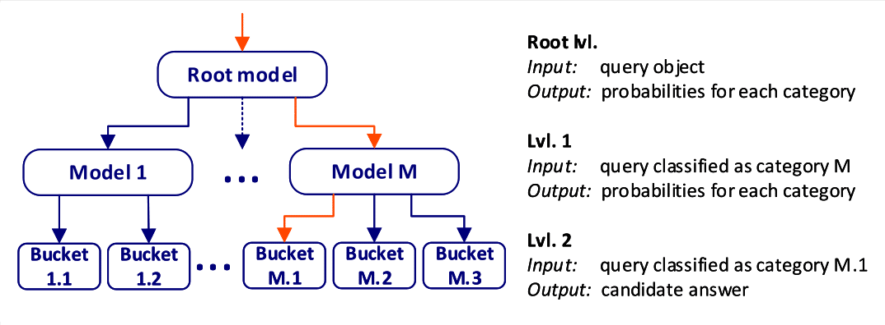
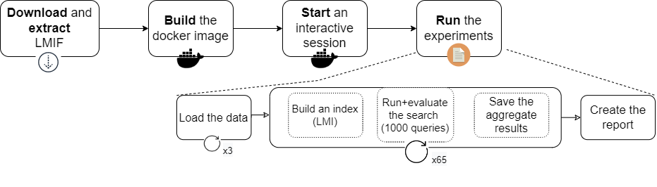
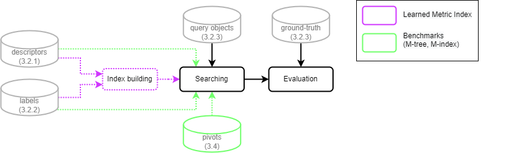

# Learned Metric Index Framework
Learned Metric Index (`LMI`) is a ML-based index for computing approximate nearest neighbor queries in complex data.



Contents
========

 * [Introduction](#intro)
 * [Installation](#installation)
 * [Usage](#usage)
 * [Experiment configurations](#output-structure)
 * [Datasets](#datasets)
 * [Workflow](#workflow)

### Introduction
This framework was created as a reproducibility tool for our experiments in:

**"LMI Proposition" ([1]):**
> M. Antol, J. Ol'ha, T. Slanináková, V. Dohnal: [Learned Metric Index—Proposition of learned indexing for unstructured data](https://www.sciencedirect.com/science/article/pii/S0306437921000326?casa_token=EvG8iaWkqQUAAAAA:xgfbutrsNGcBXnTN-U4MQ65hgmPE3fAyzwqtijzGC-JRrkO1IYNmcN3A8yMsSOT3CCoHpqVtMA). Information Systems, 2021 - Elsevier (2021)

and
**"Data-driven LMI" ([2]):**
> T. Slanináková, M. Antol, J. Ol'ha, V. Kaňa, V. Dohnal: [Learned Metric Index—Proposition of learned indexing for unstructured data](https://link.springer.com/chapter/10.1007/978-3-030-89657-7_7). SISAP 2021 - Similarity Search and Applications pp 81-94 (2021)

You can use LMI to index any kind of high-dimensional vectors. The core idea is the use of various machine learning models as nodes, and having the inference of these models produce the search results. In [1] we employ supervised learning from a pre-existing partitioning of the data. In [2] the process is completely unsupervised.

We also worked with students that used LMI for searching in text data and protein data

### Searching in action:
You can check out our [web application demonstrating our search](https://web.lmi.dyn.cloud.e-infra.cz/) on images and proteins chains.

### Dowload the data using Mendeley data: [https://data.mendeley.com/datasets/8wp73zxr47/6](https://data.mendeley.com/datasets/8wp73zxr47/6)

### Unzip the data:
```shell
$ # (1) navigate to the directory you want to use
$ # (2) Extract the compressed input data files either manually or using the unzip command (if available)
$ unzip data.zip
$ # (3) Extract the compressed source code files
$ unzip LMIF.zip
```

### Installation

#### Prerequisites:
1. Docker (ver. >=20.10.13)
3. 45GB of storage space
4. 300GB of main memory. This amount of memory is necessary to run all the experiments. If the reader wishes to run only some subset, less memory might be sufficient

#### Installation Method 1: With docker

```shell
$ # (4) Navigate to the source code directory and build the image:
$ cd LMIF && docker build -t repro-lmi -f Dockerfile . --network host
$ # (5) Check if the `repro-lmi` image was successfully built by listing your docker images:
$ docker images
$ # (6) Start the interactive session and map the input and output directories from/to your local machine. Note that the full path to your current directory needs to be provided:
$ docker run -it -v <full-path-host-machine>/LMIF/outputs:/learned-indexes/outputs -v <full-path-host-machine>/datasets:/learned-indexes/data repro-lmi /bin/bash
```

#### Installation Method 2: Without docker 
Note that this method was not tested on Windows or MacOS.
```shell
$ # create and activate the python virtual environment
$ python -m venv env && source env/bin/activate
$ # install the required packages
$ pip install -r requirements.txt
```

### Usage
---

```shell
$ # (8) Run the quick experiments, generate the report
$ python3 run-experiments.py `cat quick-experiments.txt` 2>&1 | tee outputs/experiments-quick.log
$ python3 create-report.py
$ # The partial output is in outputs/report.html
$ # (9) Run the rest of the experiments
$ python3 run-experiments.py `cat experiments.txt` 2>&1 | tee outputs/experiments.log
$ python3 create-report.py
```
Note that running all of the experiments is quite time and memory consuming, took us 74 days and 350GB RAM on a one-core Intel Xeon Gold 5120.

Generate the report:
```shell
$ python3 create-report.py outputs/
```

### Datasets
---

| Dataset  | N. of objects | Descriptor length | Filesize (GB)  \\ 
| ---    | ---     | ---  | --- |
CoPhIR   | 1M      | 284  | 0.748 |
Profiset | 1M      | 4096 | 23    |
MoCap    | 350k    | 4096 | 6.8   |       

### Workflow
---

#### All of the experiments (65)




#### A Single experiment


